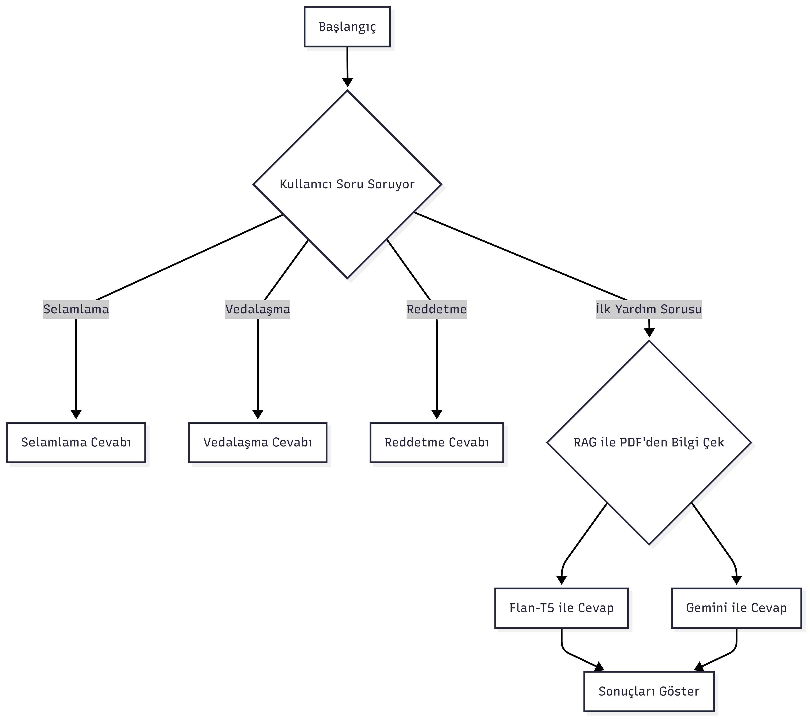
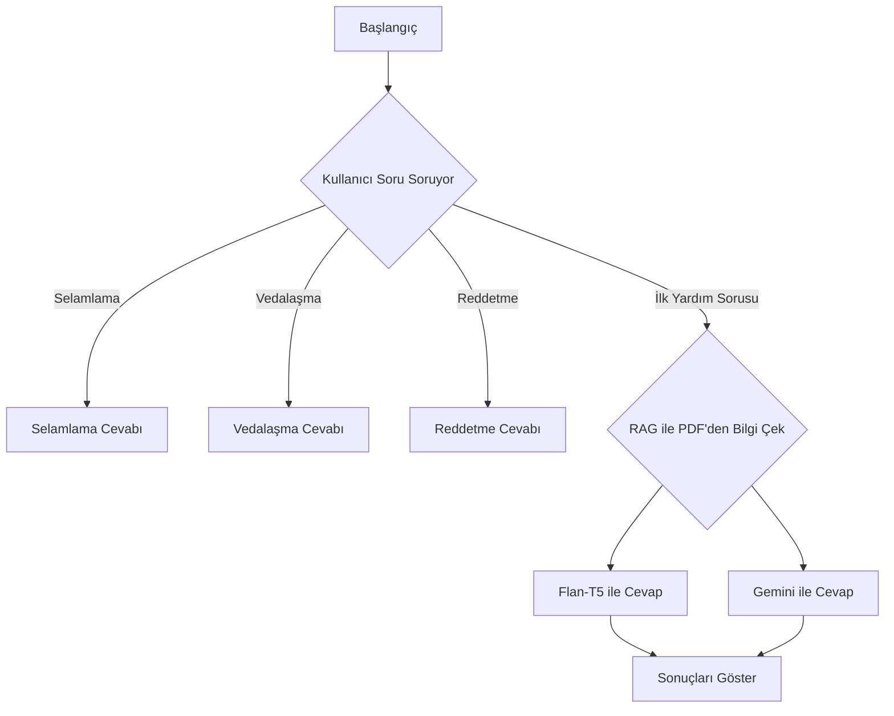
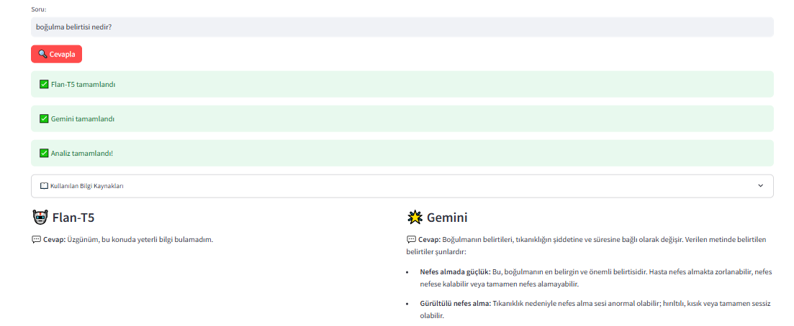
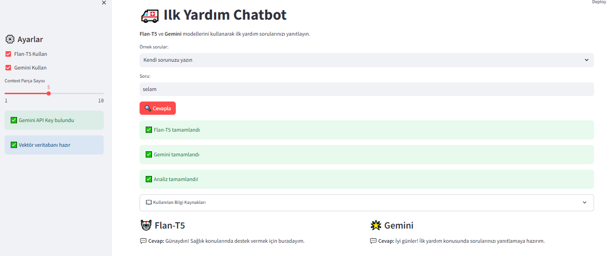
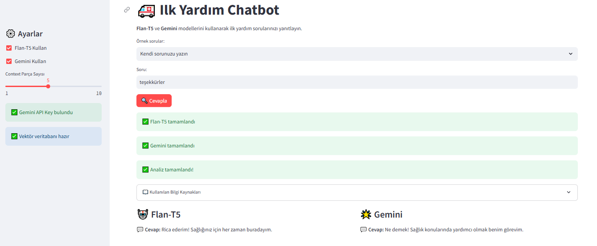

# 🚑 X Konulu Chatbot Geliştirme Süreci

Bu proje, İlk Yardım konusunda, yapay zekâ destekli bir chatbot geliştirme sürecini kapsamaktadır. PDF'den bilgi çekerek, Flan-T5 ve Gemini modelleriyle RAG tabanlı cevaplar üretir ve modelleri karşılaştırır.

---

## 🚦 Başlangıç

- Proje bireysel olarak hazırlanmıştır.
- Konu: **İlk Yardım** 
- Kullanıcıdan gelen sorulara PDF'ten bilgi çekerek cevap verir.

---

## 🧠 Chatbot Akışı

- Selamlama
- Vedalaşma
- Reddetme
- İlk yardımla ilgili sorulara yanıt

## Chatbot Akış Diyagramı





---

## 🗃️ Veri Seti ve Bilgi Kaynağı

- Ana bilgi kaynağı: **PDF dosyası** (`data/ilk-yardim.pdf`) 
- T.C.Sağlık Bakanlığı Temel Sağlık Hizmetleri Genel Müdürlüğünün yayınladığı ***TEMEL İLKYARDIM UYGULAMALARI EĞİTİM KİTABI*** kullanılmıştır.


---

## 🤖 LLM Model Seçimi ve Eğitimi

- Kullanılan modeller:
  - **Flan-T5** (local, ücretsiz)
  - **Gemini** (Google, API ile)
- Neden bu modeller?
  - Flan-T5: Açık kaynak, ücretsiz, kolay erişim
  - Gemini: Güncel, güçlü, bulut tabanlı ve ücretsiz versiyonu var
- API anahtarı gereksinimi: Sadece Gemini için `.env` dosyasına eklenmeli

---

## 📊 Model Performansı Karşılaştırması

RAG tabanlı chatbot geliştirildiği için Precision, Recall ve F1 Score değerleri hesaplanamamıştır.
Kullanıcı gözüyle manuel gerçekleştirilen testlerde Gemini'nin çok daha iyi ve tutarlı cevap verdiği görülmüştür.
Özellikle Flan-T5 modelinde context uzunluğu kısıtı nedeniyle bazı sorularda düşük performans gözlemlenmiştir.

## 🖥️ Uygulama Arayüzü

- Streamlit ile hazırlanmış web arayüzü
- Kullanıcıdan soru alır, iki modelin cevabını yan yana gösterir

**Ekran Görüntüleri:**

<p align="center">
  
  
  
</p>

---

## 📁 Proje Yapısı

```
├── data/
│   ├── chatbot_dataset.xlsx
│   └── ilk-yardim.pdf
├── models/
│   ├── flan_t5_rag_model.py
│   ├── gemini_rag_model.py
│   └── base_model.py
├── rag/
│   ├── rag_pipeline.py
│   └── __init__.py
├── app/
│   └── streamlit_app.py
├── images/
│   ├── örnek-soru.PNG
│   ├── selamlama.PNG
│   └── vedalasma.PNG
├── requirements.txt
├── README.md
```

---

## 🚀 Kurulum ve Çalıştırma

```bash
# Bağımlılıkları yükle
pip install -r requirements.txt

# .env dosyasına Gemini API anahtarınızı ekleyin (sadece Gemini için)
echo GEMINI_API_KEY=your-gemini-api-key > .env

# Uygulamayı başlatın
streamlit run app/streamlit_app.py
```


---

## 📝 Notlar ve Yorumlar

- Flan-T5 modelinde context (girdi uzunluğu) kısıtı nedeniyle bazı sorularda yetersiz cevaplar alınabiliyor.
- Gemini modeli daha tutarlı ve uzun cevaplar üretebiliyor.
- PDF tabanlı bilgi çekme (RAG) ile chatbot, güncel ve güvenilir bilgi sunabiliyor.

## 🎯 Özellikler

- **İki Model Karşılaştırması**: Flan-T5 ve Gemini modellerini aynı anda çalıştırma
- **RAG Sistemi**: PDF'den bilgi çıkarma ve context-aware cevaplar
- **Streamlit Arayüzü**: Kullanıcı dostu web arayüzü

## 🚀 Kurulum

### 1. Gereksinimler

- Python 3.8+
- Gemini API anahtarı (opsiyonel - sadece Gemini kullanmak için)

### 2. Kurulum Adımları

```bash
# Repository'yi klonlayın
git clone <repository-url>
cd chatbot

# Sanal ortam oluşturun (önerilen)
python -m venv venv
source venv/bin/activate  # Linux/Mac
# veya
venv\Scripts\activate     # Windows

# Bağımlılıkları yükleyin
pip install -r requirements.txt
```

### 3. API Key Ayarları (Opsiyonel)

**Gemini kullanmak istiyorsanız** `.env` dosyası oluşturun:

```bash
# .env dosyası oluşturun
touch .env  # Linux/Mac
# veya
echo. > .env  # Windows
```

`.env` dosyasına API key'inizi ekleyin:

```env
# Gemini API Key
GEMINI_API_KEY=your-gemini-api-key-here

# Diğer API key'ler buraya eklenebilir
# OPENAI_API_KEY=your-openai-api-key-here
```

**Önemli**: `.env` dosyasını `.gitignore`'a ekleyin ki API key'iniz GitHub'a yüklenmesin!

**Not**: Flan-T5 modeli API key gerektirmez ve her zaman çalışır.

### 4. Vektör Veritabanı Kurulumu

**Hızlı kurulum (önerilen):**
```bash
# Otomatik kurulum
python run_app.py --auto-setup

# Manuel kurulum
python setup_database.py
```

## 🎮 Kullanım

### Hızlı Başlatma

```bash
# Uygulamayı çalıştır (otomatik kurulum ile)
python run_app.py --auto-setup

# Sadece uygulamayı çalıştır
python run_app.py

```

### Manuel Çalıştırma

```bash
# Streamlit uygulamasını başlatın
streamlit run app/streamlit_app.py
```

Tarayıcınızda `http://localhost:8501` adresine gidin.


## 📊 Model Karşılaştırması

| Özellik | Flan-T5 | Gemini |
|---------|---------|--------|
| **Model Tipi** | Local | Cloud |
| **Hız** | Hızlı | Orta |
| **Doğruluk** | Kötü | İyi |
| **Maliyet** | Ücretsiz | API ücreti |
| **Gizlilik** | Tam | Kısmi |
| **API Key** | Gerekmez | .env dosyasında |


**Not**: Bu proje eğitim amaçlıdır. Gerçek ilk yardım durumlarında mutlaka profesyonel yardım alın. 